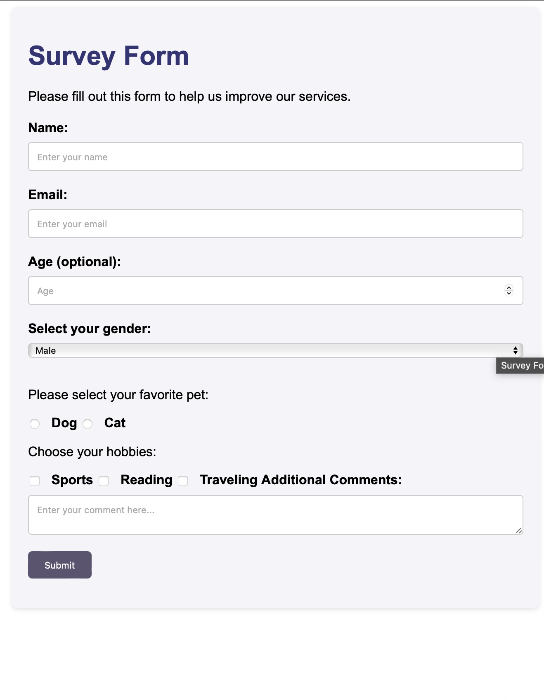

# Survey Form Project

## Introduction

This project involves creating a survey form that is functionally similar to the example provided by FreeCodeCamp. It is designed to showcase my ability to build a web form with various input elements and styles according to the specifications given in the user stories provided by FreeCodeCamp.



## Project Description

The objective of this project was to build an interactive survey form using HTML and CSS. The form includes various types of input fields such as text boxes, email input fields, number input fields, radio buttons, checkboxes, a dropdown, a textarea, and a submit button. This project helps in understanding and implementing form validations and responsive design principles to enhance user experience.

## Features

- **Responsive Design**: Ensures that the form is accessible across different devices and screen sizes.
- **HTML5 Validation**: Utilizes HTML5 form validation to check the correct format of inputs like email and to ensure required fields are not left blank.
- **Interactive Elements**: Includes interactive elements like placeholder text, hover effects on buttons, and custom styling on inputs and labels.

## Technologies Used

- **HTML5**: For structuring the content and forms.
- **CSS3**: For styling the layout and design of the form.

## Setup

To run this project locally, follow these steps:

1. Clone the repository to your local machine:

   ```bash
   git clone https://github.com/Researcher0619/survey-form.git
